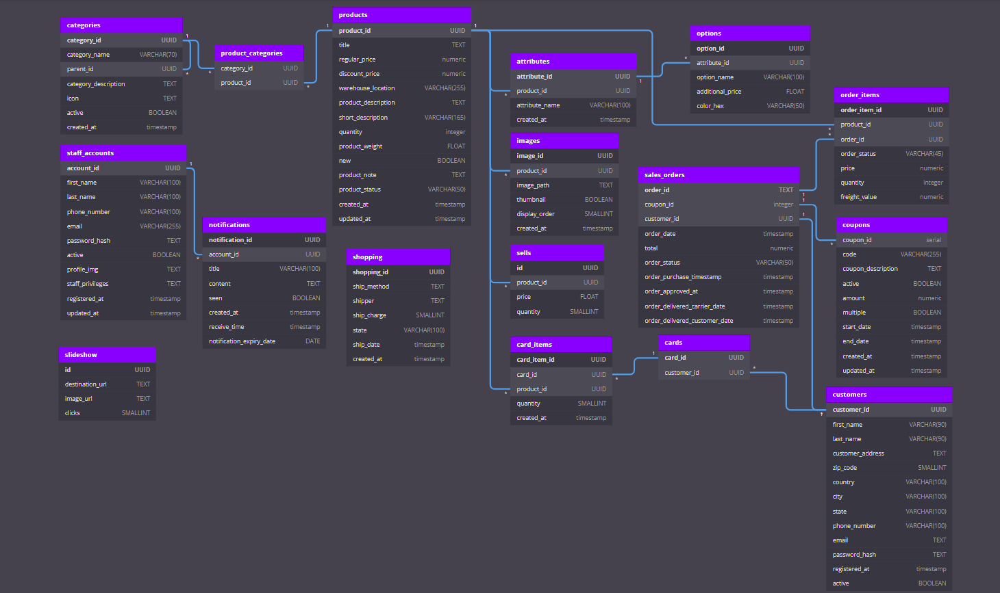

## <h3 align="center">DropGala Database Configuration</h3>

### Database Diagram:

<p align="center"></p>

Website : https://dropgala.com

### pgadmin ssh:

check: https://medium.com/3-elm-erlang-elixir/faq-how-to-connect-pgadmin4-to-db-through-ssh-tunnel-with-public-key-authentication-b351750c20be

Nginx-keepalive: https://www.digitalocean.com/community/tutorials/how-to-set-up-highly-available-web-servers-with-keepalived-and-floating-ips-on-ubuntu-14-04

### environment variables

Setting an environment variable for a droplet is a little more complicated than for an app running on the app platform.

Follow these steps to set environment variables on a Linux droplet:

SSH into your droplet. If you’re not sure how to do that, see here
Once connected, run the following command to set your environment variable:

```bash
$ export YOUR_VARIABLE_KEY=<your-variable-value>
```

## Let's Ecnrypt

```bash
$ sudo openssl dhparam -out /home/isaac/dropgala_database/dhparam/dhparam-2048.pem 2048
```

<!-- location @nodejs {
                proxy_pass http://nodejs:8080;
                add_header X-Frame-Options "SAMEORIGIN" always;
                add_header X-XSS-Protection "1; mode=block" always;
                add_header X-Content-Type-Options "nosniff" always;
                add_header Referrer-Policy "no-referrer-when-downgrade" always;
                add_header Content-Security-Policy "default-src * data: 'unsafe-eval' 'unsafe-inline'" always;
                # add_header Strict-Transport-Security "max-age=31536000; includeSubDomains; preload" always;
                # enable strict transport security only if you understand the implications
        } -->
